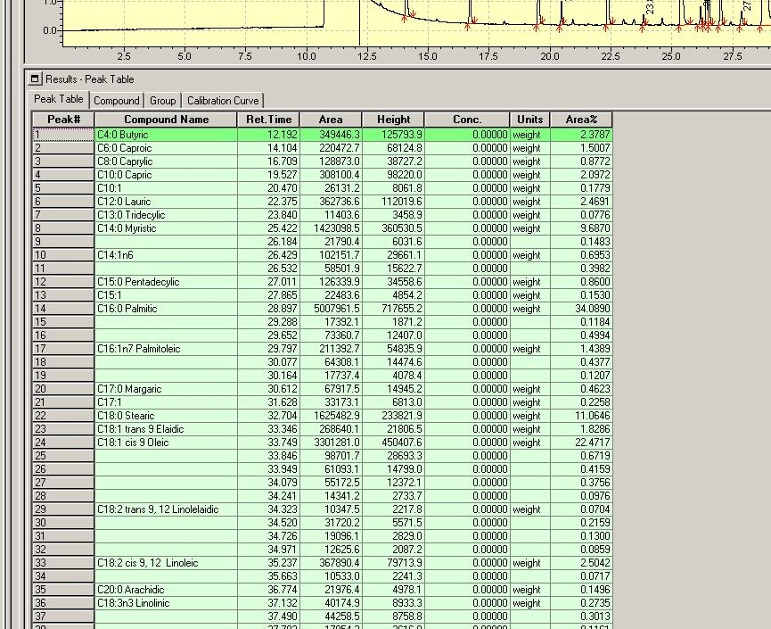
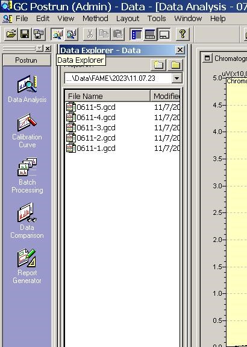
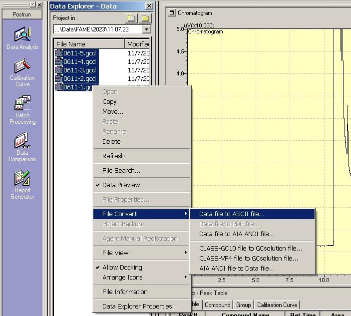
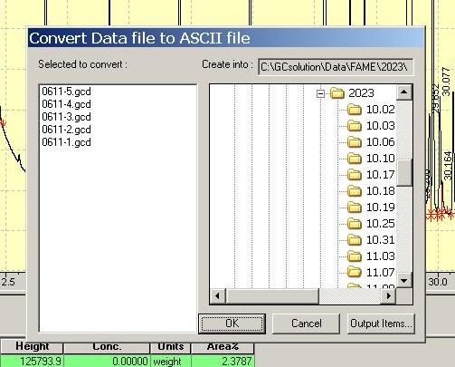
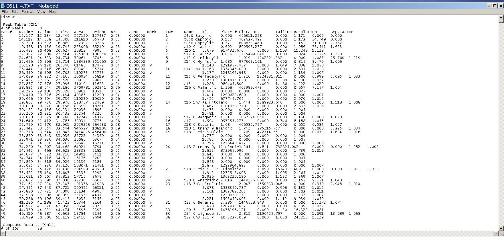
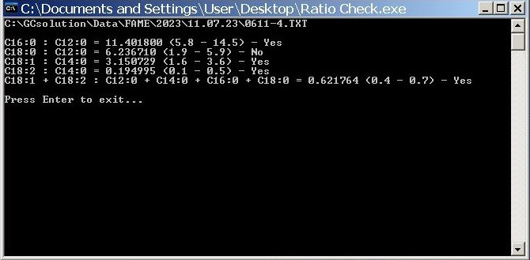

# Check the ratio of fatty acids after analysis on the Shimadzu GC in accordance with GOST 32261

This program processes a data file from a Shimadzu GC, extracting the areas of specified fatty acids for further ratio analysis. The GOST 32261 standard establishes norms for the ratios of free fatty acids to determine the presence of fats of plant origin. The chromatographic method should specify the retention times of peaks of free fatty acids, whose names contain at least those:
- C12:0
- C14:0
- C16:0
- C18:0
- C18:1 trans
- C18:1 cis
- C18:2 trans
- C18:2 cis



## Compilation script

To compile the program with icon, execute the following commands:

```
windres resource.rc -O coff -o resource.res
```
```
gcc ratio_checker.c resource.res -o ratio_checker.exe
```
## Fatty Acid Ratios
The program calculates various ratios of fatty acids based on GOST 32261
| Ratio | Range |
|--|--|
| C16:0 : C12:0 | 5.8 - 14.5 |
| C18:0 : C12:0 | 1.9 - 5.9 |
| C18:1 : C14:0 | 1.6 - 3.6 |
| C18:2 : C14:0 | 0.1 - 0.5 |
| C18:1 + C18:2 : C12:0 + C14:0 + C16:0 + C18:0 | 0.4 - 0.7 |
## How to compute ratios
Open the Postrun program with the Data Explorer panel



Navigate to the desired directory, select files with the gcd extension -> File Convert -> Data file to ASCII file...



Press OK



Files with the txt extension will appear in the working directory. Each file will contain data from the chromatography of a single analysis



You can perform calculations by command ```<path_to_file_folder>/ratio_checker.exe <path_to_file_folder>/<file_name>.txt``` or simply drag and drop a file with the txt extension onto the program icon



OR just use GUI application for Windows! Compile it with command:
```
gcc ratio_checker_gui.c resource.res -o "Ratio checker.exe"
```
